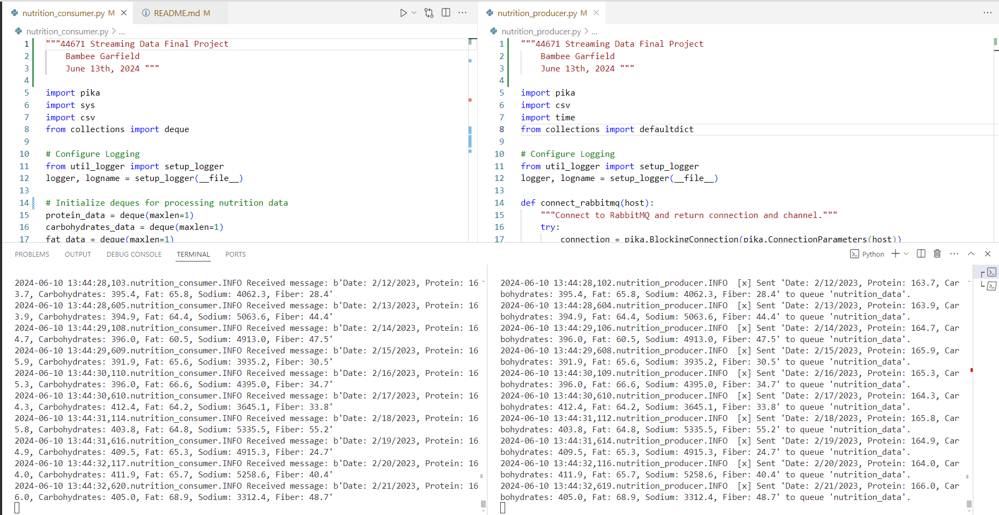
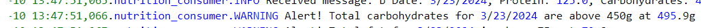
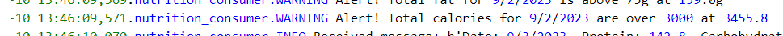
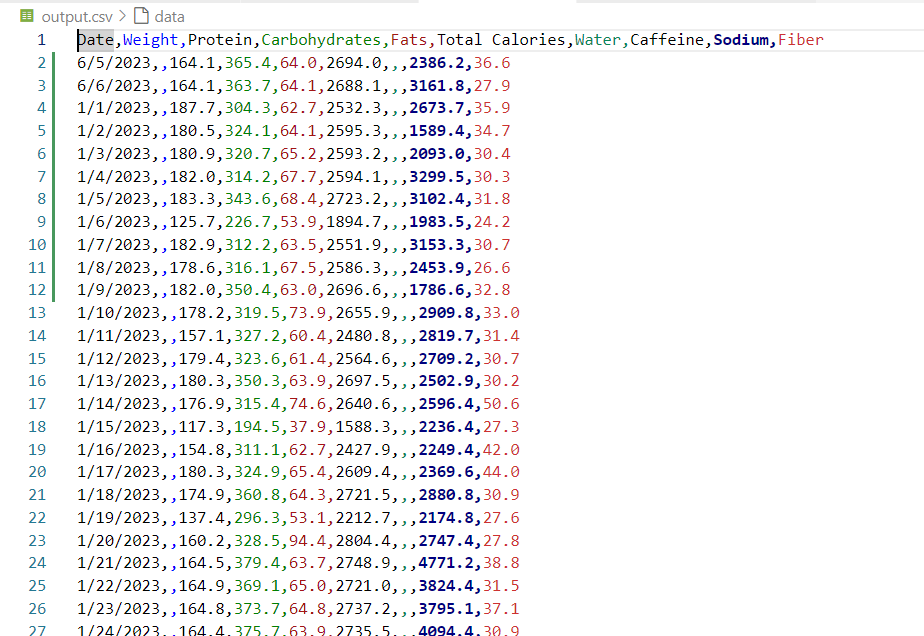

## Bambee Garfield
## CSIS 44671 - Module 7

# streaming-07-final

Project Requirements:
Requirements - Custom Streaming Project
Be sure to address these in your project:

1. Create a custom GitHub project repo to showcase your skills.
2. Describe and plan an new implementation using RabbitMQ for streaming data. 
3. Create one or more custom producers.
4. Create one or more custom consumers.
5. You can simulate your initial data source using Faker or some other file - or read from an API (not too much, too often, or too fast!)
6. How did you explore exchanges and queues?
7. Did you use time windows?

My Project:
Data was downloaded from my personal myfitnesspal.com log. The data is clunky and hard to use in their format. Each meal per day has it's own line with numerous columns of macro and micro nutrients. 

The first thing the code does is to aggregate the data for each day and then only look at the columns I care about:
    -Protein (g)
    -Carbohydrates (g)
    -Fats (g)
    -Sodium (mg)
    -Fiber (g)
    -Calculate total calories based on 4 cal/g on both protein and carbs, 9 cal/g on fat

Conditions To monitor
-Certain macronutrients are too high or too low on any given day:
    -Protein <120g
    -Carbohydrates >450g
    -Fats > 75g
    -Total calories >3000
-Create alerts for each of these

Create a usable output file
Columns for output file are as follows:
-Date
-Weight (not used in this file)
-Protein (g)
-Carbohydrates (g)
-Fats (g)
-Total calories
-Water (not used in this file)
-Caffeine (not used in this file)
-Sodium (mg)
-Fiber (g)

Requirements
-RabbitMQ server running
-pika installed in your active environment

## Before You Begin 

1. In GitHub, create a new repo for your project - name it streaming-07-final
2. Add a README.md during the creation process.
3. Clone your repo down to your machine. 
4. In VS Code, add a .gitignore (use one from an earlier module).
5. Download data file from myfitnesspal.com for last 18 months
6. Add the csv data file to your repo. 

## Create a Producer
Implement producer to read data from nutrition summary file. 

## Creat a Consumer 

1. Implement your consumer. 
2. Use the logic, approach, and structure from all course modules
3. These provide a current and solid foundation for streaming analytics - modifying them to serve your purpose IS part of the assignment.
4. Do not start from scratch - do not search for code - do not use a notebook.
5. Use comments in the code and repo to explain your work. 
6. Use docstring comments and add your name and date to your README and your code files. 
7. Explain your project in the README. Include prerequisites and how to run your code. 

## Run consumer and producer
 1. Open a CMD prompt as an administrator 
    -Change directories to the folder where your project is housed
 2. Or open a 2nd terminal window in VS code
 3. Run python nutrition_producer.py in command prompt/VS Code terminal
 4. Run nutrition_consumer.py in VS Code terminal

## Reference

- [My Fitness Pal export](https://www.myfitnesspal.com/reports/printable-diary/bambeeg)

## Screenshot

Show a example of your project here with:
1. Producer
2. Consumer

Show significant events:
1. Visible protein alert w

2. Visible carbohydrate alert

3. Visible fat alert

4. Visible total calories alert

Show output
1. Output file
