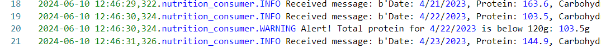
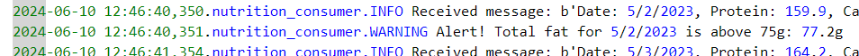

## Bambee Garfield
## CSIS 44671 - Module 6

# streaming-06-smart-smoker-consumer

Project Requirements:
Smart Smoker System
-Read about the Smart Smoker system here: Smart Smoker
-We read one value every half minute. (sleep_secs = 30)

smoker-temps.csv has 4 columns:
[0] Time = Date-time stamp for the sensor reading
[1] Channel1 = Smoker Temp --> send to message queue "01-smoker"
[2] Channe2 = Food A Temp --> send to message queue "02-food-A"
[3] Channe3 = Food B Temp --> send to message queue "02-food-B"

We want know if:
-The smoker temperature decreases by more than 15 degrees F in 2.5 minutes (smoker alert!)
-Any food temperature changes less than 1 degree F in 10 minutes (food stall!)

Time Windows
-Smoker time window is 2.5 minutes
-Food time window is 10 minutes

Deque Max Length
-At one reading every 1/2 minute, the smoker deque max length is 5 (2.5 min * 1 reading/0.5 min)
-At one reading every 1/2 minute, the food deque max length is 20 (10 min * 1 reading/0.5 min) 

Conditions To monitor
-If smoker temp decreases by 15 F or more in 2.5 min (or 5 readings)  --> smoker alert!
-If food temp change in temp is 1 F or less in 10 min (or 20 readings)  --> food stall alert!

Requirements
-RabbitMQ server running
-pika installed in your active environment

## Before You Begin 

1. In GitHub, create a new repo for your project - name it streaming-06-smart-smoker-consumer
2. Add a README.md during the creation process. (If not, you can always add it later.)
3. Clone your repo down to your machine. 
4. In VS Code, add a .gitignore (use one from an earlier module), start working on the README.md. Create it if you didn't earlier.
5. Add the csv data file to your repo. 
6. Create a file for your bbq producer.

## Create a Python Virtual Environment

We will create a local Python virtual environment to isolate our project's third-party dependencies from other projects.

1. Open a terminal window in VS Code.
2. Use the built-in Python utility venv to create a new virtual environment named `.venv` in the current directory.

python -m venv .venv

In the same VS Code terminal window, activate the virtual environment.

- On Windows, run: `.venv\Scripts\activate`

## Create and implement the Consumer 

1. Implement your smoker consumer. 
2. Use the logic, approach, and structure from Module 5
3. These provide a current and solid foundation for streaming analytics - modifying them to serve your purpose IS part of the assignment.
4. Do not start from scratch - do not search for code - do not use a notebook.
5. Use comments in the code and repo to explain your work. 
6. Use docstring comments and add your name and date to your README and your code files. 
7. Explain your project in the README. Include prerequisites and how to run your code. 

## Run consumer and producer
 1. Open a CMD prompt as an administrator
 2. Change directories to the folder where your project is housed
 3. Run python smoker_producer.py in command prompt
 4. In VS Code, run smoker_consumer.py

## Reference

- [RabbitMQ Tutorial - Work Queues](https://www.rabbitmq.com/tutorials/tutorial-two-python.html)

## Screenshot

Show a example of your project here with:
1. Producer
2. Smoker monitor
3. Food A monitor (Roast)
4. Food B monitor (Ribs)

Show significant events:
1. Visible smoker alert with timestamp

2. Visible Food A (roast) with timestamp

3. Visible Food B (ribs) with timestamp
